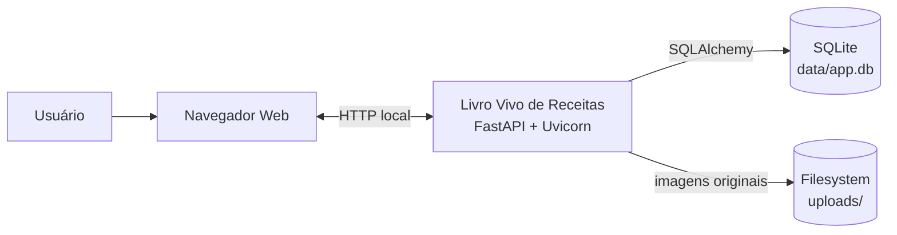
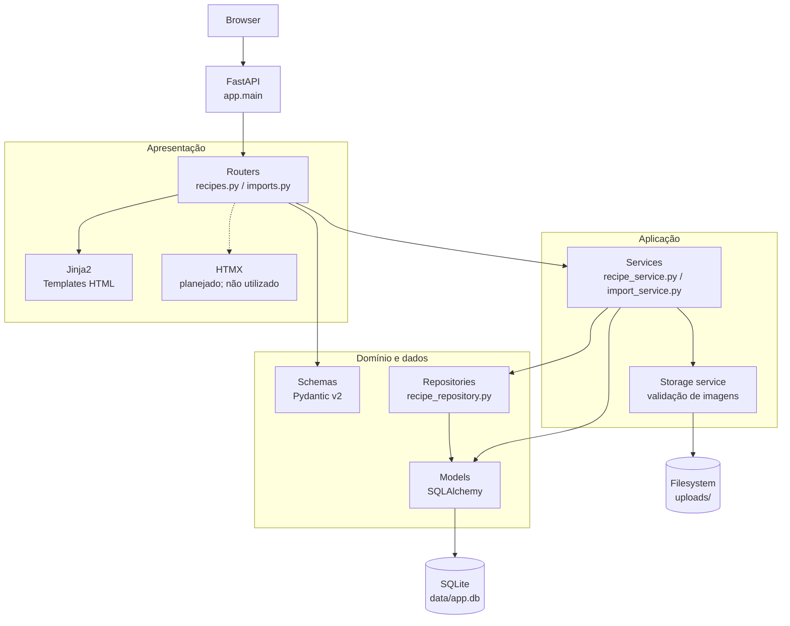
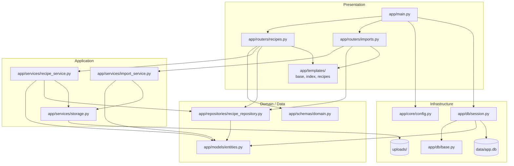
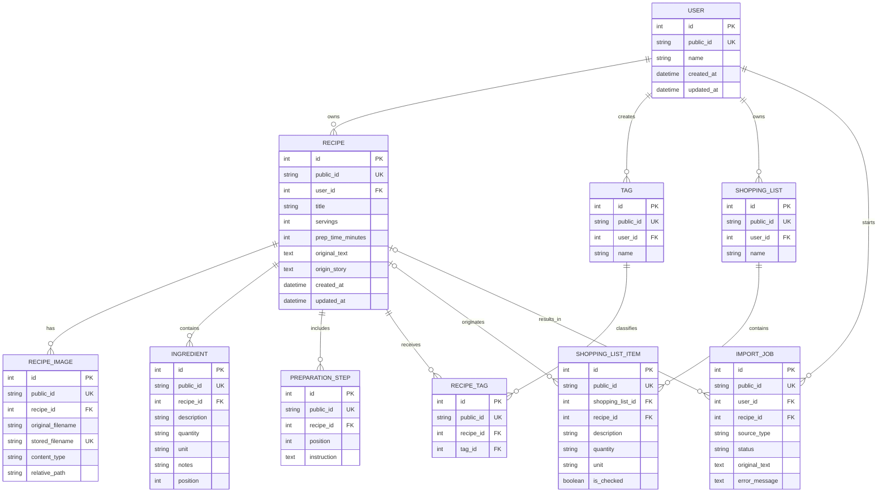
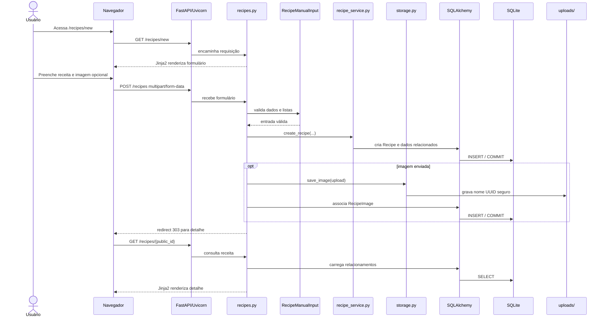
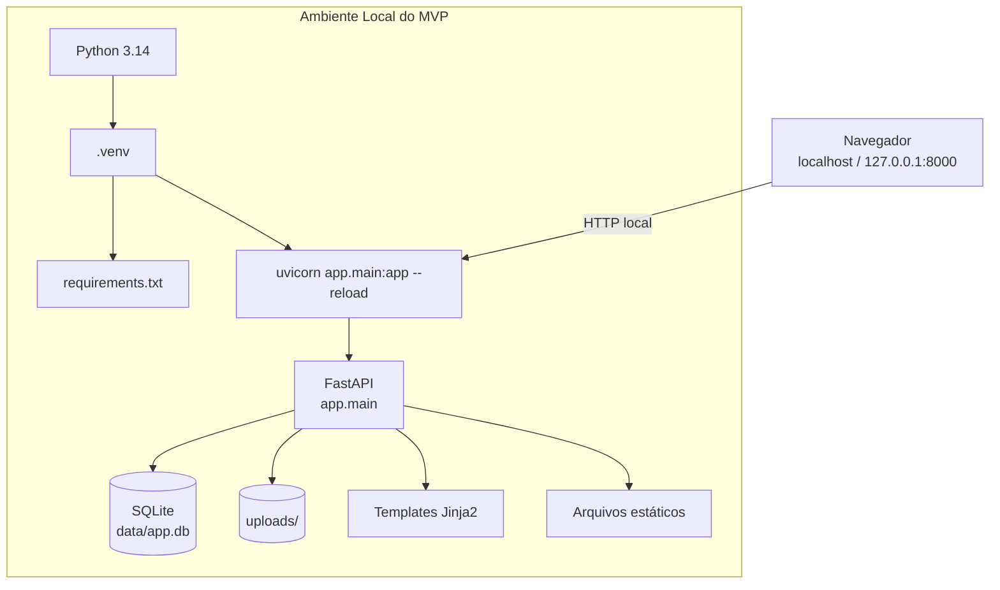
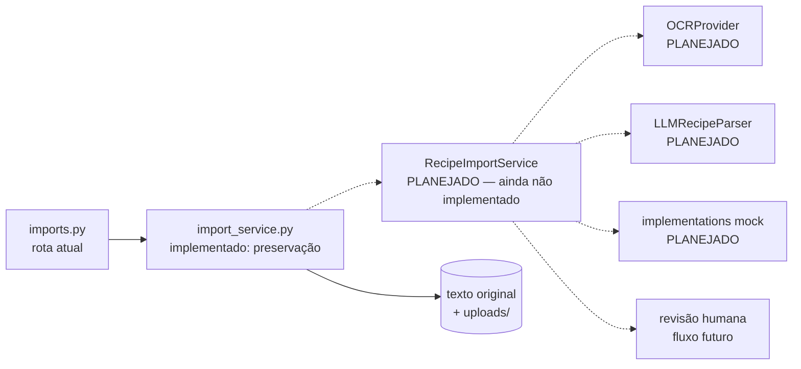

# Diagramas Arquiteturais — Livro Vivo de Receitas

## 1. Objetivo

Este documento registra visualmente a arquitetura efetivamente implementada do
MVP local após os Prompts 01–04. Os diagramas complementam
`docs/ARCHITECTURE.md` e servem como referência rápida para desenvolvimento,
revisão técnica e evolução incremental.

## 2. Escopo atual

O estado documentado inclui o scaffold FastAPI, a modelagem SQLAlchemy, o fluxo
manual de receitas, o CRUD web, a preservação de imagens locais e os endpoints
JSON iniciais. A execução é local com Python 3.14, SQLite em `data/app.db` e
arquivos em `uploads/`.

IA real, OCR real, RAG, PostgreSQL, pgvector, Docker, storage externo,
autenticação real e infraestrutura de produção continuam fora do escopo. A
importação atual preserva texto/imagem e cria um `ImportJob` pendente, sem
estruturação automática.

## 3. Contexto da Solução

O usuário acessa a aplicação pelo navegador. FastAPI/Uvicorn atende as
requisições locais, SQLAlchemy persiste dados no SQLite e o storage local mantém
as imagens originais.



Não há APIs de terceiros ou serviços de nuvem participando da arquitetura atual.

## 4. Arquitetura Lógica

As rotas recebem requisições, validam formulários com Pydantic, delegam casos de
uso aos services e usam repositories/modelos para consultar e persistir dados.
Templates Jinja2 retornam HTML; o endpoint JSON oferece uma base para futuras
interfaces. HTMX está previsto na arquitetura, mas ainda não participa dos
fluxos atuais.



## 5. Componentes e Módulos



Os testes em `tests/` cobrem endpoints básicos, criação do banco e o fluxo
manual ponta a ponta. `app/static/` existe para estáticos locais mínimos; o
estilo atual usa Tailwind CSS via CDN.

## 6. Modelo de Dados

As entidades abaixo são as implementadas em `app/models/entities.py`. Os IDs
inteiros são internos e cada entidade possui `public_id` textual UUID.



`recipe_id` é opcional em `ShoppingListItem` e `ImportJob`; por isso esses dois
relacionamentos são representados como opcionais. As tabelas de lista de
compras existem no modelo, mas ainda não possuem páginas ou services próprios.

## 7. Fluxo de Cadastro Manual



O texto original, a história/origem e a imagem original permanecem separados
dos dados editáveis estruturados. A imagem é acessada por endpoint controlado.

## 8. Ciclo CRUD de Receitas

```mermaid
flowchart LR
    UI[Templates Jinja2]
    Create[POST /recipes\ncriar]
    List[GET /recipes\nlistar]
    Read[GET /recipes/{id}\nconsultar]
    Update[POST /recipes/{id}/edit\neditar]
    Delete[POST /recipes/{id}/delete\nexcluir]
    Router[recipes.py]
    Service[recipe_service.py]
    Repository[recipe_repository.py]
    DB[(SQLite)]
    Files[storage.py\nuploads/]

    UI --> Create
    UI --> List
    UI --> Read
    UI --> Update
    UI --> Delete
    Create --> Router
    List --> Router
    Read --> Router
    Update --> Router
    Delete --> Router
    Router --> Service
    Router --> Repository
    Service --> DB
    Repository --> DB
    Create -.->|imagem opcional| Files
    Update -.->|imagem opcional| Files
    Read -.->|endpoint controlado| Files
    Delete -.->|remove imagem associada| Files
```

Também existem os endpoints JSON `GET /api/recipes` e
`GET /api/recipes/{public_id}`. O fluxo de lista de compras ainda não foi
implementado como funcionalidade web.

## 9. Arquitetura de Execução Local



Esta visão representa apenas execução local, não produção. Tailwind CSS é
carregado via CDN no navegador, conforme a decisão do MVP, mas não existe
serviço externo obrigatório para a aplicação, o banco ou o armazenamento local.

## 10. Ponto de Extensão para Importação Assistida

Os componentes tracejados são planejados para o próximo ciclo. Atualmente,
`app/services/import_service.py` apenas preserva texto/imagem e cria
`ImportJob(status="pending")`.



Nenhum provider real, chave externa, LLM ou OCR está representado como parte da
arquitetura atual.

## 11. Observações Arquiteturais

### Decisões identificadas

- monólito modular local, adequado ao MVP;
- renderização server-side com Jinja2;
- SQLite em `data/app.db` e filesystem em `uploads/`;
- usuário demo, sem autenticação real;
- nomes internos UUID para imagens e validação de tipo/tamanho;
- separação entre routers, services, repositories, schemas e modelos;
- dados originais preservados separadamente dos dados estruturados.

### Inconsistências encontradas

- `docs/ARCHITECTURE.md` sugere `app/config.py`, mas o código usa
  `app/core/config.py`;
- o documento usa `InstructionStep`, enquanto o modelo real usa
  `PreparationStep`;
- `docs/ARCHITECTURE.md` foi originalmente escrito antes da implementação e
  ainda descreve algumas capacidades como futuras;
- HTMX está na stack aprovada, mas ainda não é utilizado nos templates atuais;
- modelos de lista de compras existem, porém não há fluxo web correspondente;
- não existe ainda o pacote `processors/` previsto para providers de IA/OCR.

### Limitações atuais

- importação não estrutura automaticamente texto ou imagem;
- não há IA/OCR real;
- não há CRUD de lista de compras;
- não há autenticação ou multiusuário real;
- inicialização de banco usa `create_all` e ajuste local simples, sem Alembic;
- Tailwind depende do CDN para carregar estilos no navegador.

### Pontos de evolução

1. executar o Prompt 05 com providers mockados de importação;
2. manter a preservação e a revisão humana das fontes originais;
3. adicionar lista de compras em ciclo próprio;
4. revisar `docs/ARCHITECTURE.md` para alinhar nomes e estado implementado;
5. somente depois avaliar OCR/IA reais, autenticação e demais evoluções.
