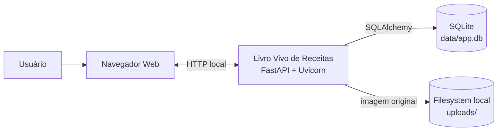
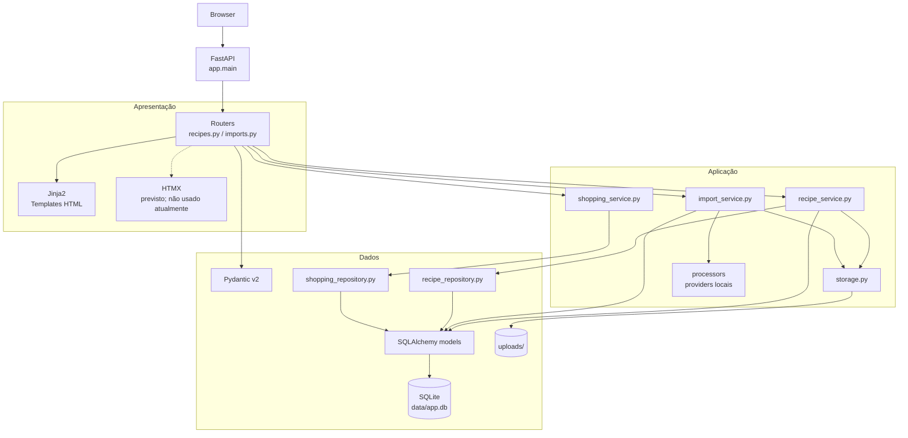
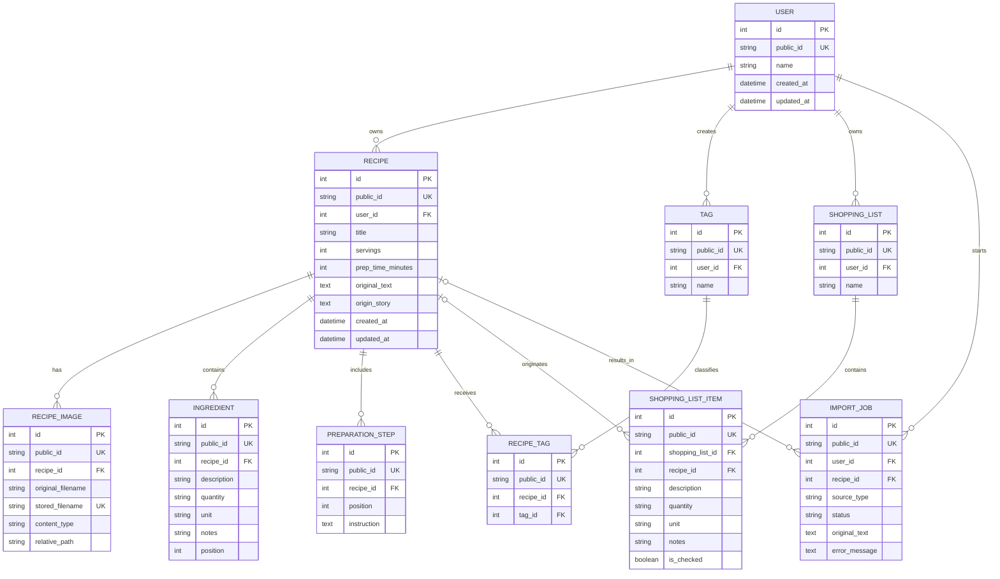
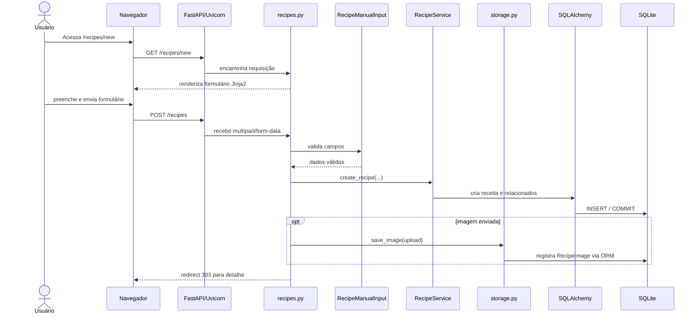
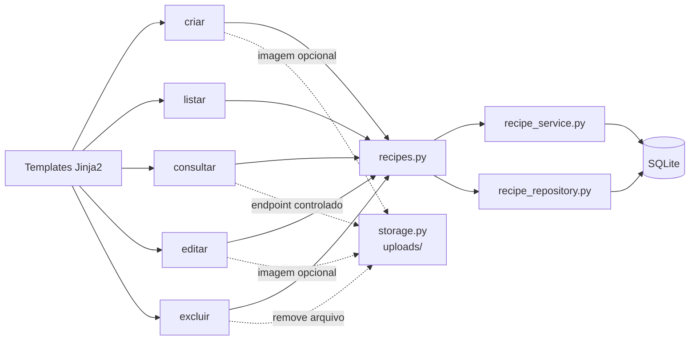
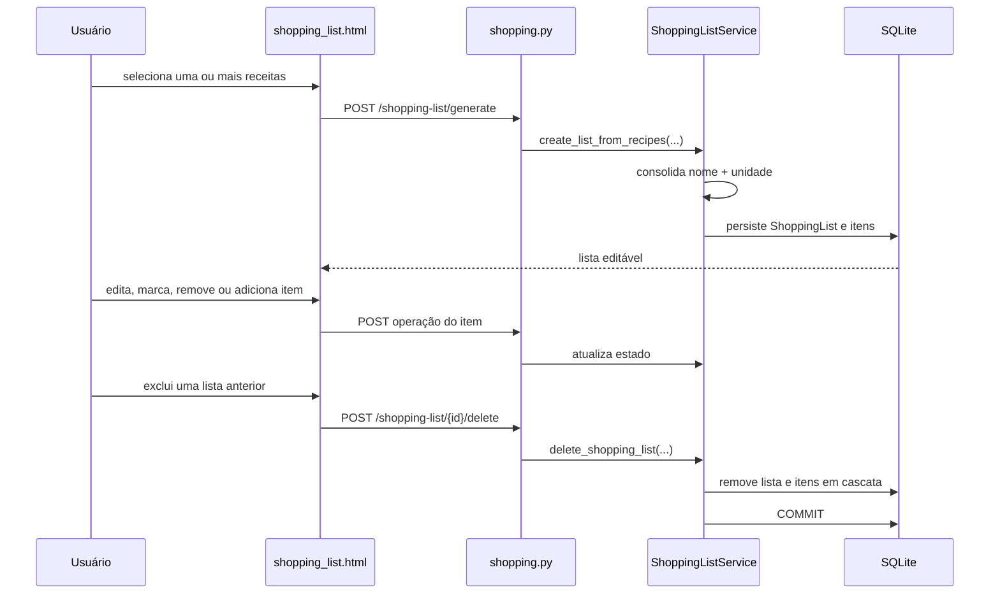
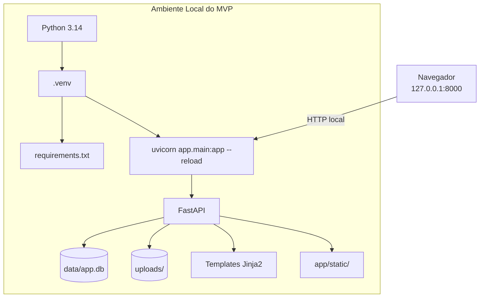
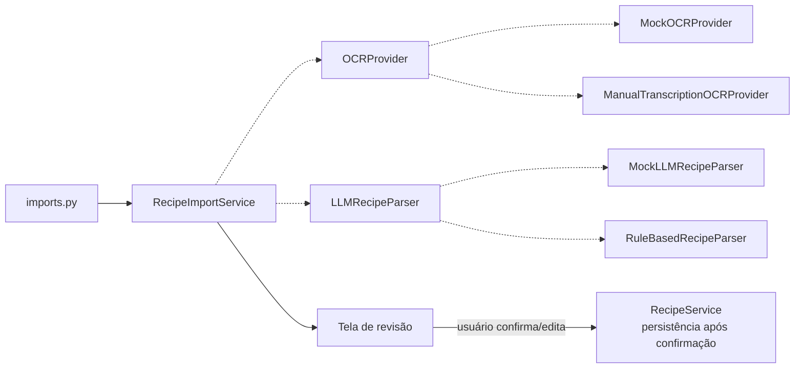

# Diagramas Arquiteturais — Livro Vivo de Receitas

## 1. Objetivo

Documentar visualmente a arquitetura efetivamente implementada do MVP local
após os Prompts 01–07. Este documento complementa
`docs/ARCHITECTURE.md`, facilitando a compreensão das camadas, dos fluxos de
receitas, da importação assistida e da lista de compras.

## 2. Escopo atual

O projeto usa Python 3.14, FastAPI/Uvicorn, SQLite em `data/app.db`, SQLAlchemy,
Pydantic v2, Jinja2, Tailwind CSS via CDN e armazenamento local em `uploads/`.

Existem dois caminhos separados para criar receitas:

- **Fluxo A — Cadastro manual:** persiste diretamente uma receita preenchida
  pelo usuário.
- **Fluxo B — Importação assistida:** extrai uma sugestão com providers locais,
  apresenta uma tela de revisão e só então persiste a receita confirmada.
- **Fluxo C — Lista de compras:** seleciona uma ou mais receitas, consolida os
  ingredientes de forma simples e permite ajustes manuais.

Não há APIs externas, chaves de API, OCR real, IA real, RAG, PostgreSQL,
pgvector, Docker, storage externo ou autenticação real.

## 3. Contexto da Solução

O navegador interage somente com a aplicação local. O banco e os arquivos são
recursos locais do MVP.

## 4. Arquitetura Lógica

O Fluxo A usa `RecipeService`; o Fluxo B usa `RecipeImportService` e providers
locais antes de chegar à persistência definitiva; o Fluxo C usa
`ShoppingListService` para consolidar e editar itens.

## 5. Componentes e Módulos

```mermaid
flowchart TB
    subgraph Presentation[Presentation]
        Main[app/main.py]
        RecipesRouter[app/routers/recipes.py]
        ImportsRouter[app/routers/imports.py]
        ShoppingRouter[app/routers/shopping.py]
        TemplatesDir[app/templates/\nbase, index, recipes, shopping_list]
    end

    subgraph Application[Application]
        RecipeSvc[app/services/recipe_service.py]
        ImportSvc[app/services/import_service.py\nRecipeImportService]
        StorageSvc[app/services/storage.py]
        ShoppingSvc[app/services/shopping_service.py\nShoppingItemInput]
    end

    subgraph Processing[Importação local]
        OCRInterface[OCRProvider]
        MockOCR[MockOCRProvider]
        ManualOCR[ManualTranscriptionOCRProvider]
        ParserInterface[LLMRecipeParser]
        MockParser[MockLLMRecipeParser]
        RuleParser[RuleBasedRecipeParser]
        Structured[schemas/import.py\nsaída estruturada]
    end

    subgraph Data[Data]
        DomainSchemas[app/schemas/domain.py]
        Entities[app/models/entities.py]
        Repo[app/repositories/recipe_repository.py]
        ShoppingRepo[app/repositories/shopping_repository.py]
        Session[app/db/session.py]
        DB[(data/app.db)]
        Uploads[(uploads/)]
    end

    Main --> RecipesRouter
    Main --> ImportsRouter
    Main --> ShoppingRouter
    Main --> Session
    RecipesRouter --> DomainSchemas
    RecipesRouter --> RecipeSvc
    RecipesRouter --> TemplatesDir
    ImportsRouter --> ImportSvc
    ImportsRouter --> TemplatesDir
    ShoppingRouter --> ShoppingSvc
    ShoppingRouter --> TemplatesDir
    RecipeSvc --> Repo
    RecipeSvc --> Entities
    RecipeSvc --> StorageSvc
    ImportSvc --> OCRInterface
    ImportSvc --> ParserInterface
    ImportSvc --> Structured
    ImportSvc --> Entities
    ShoppingSvc --> ShoppingRepo
    ShoppingSvc --> Entities
    OCRInterface -.-> MockOCR
    OCRInterface -.-> ManualOCR
    ParserInterface -.-> MockParser
    ParserInterface -.-> RuleParser
    Repo --> Entities
    ShoppingRepo --> Entities
    Session --> Entities
    Session --> DB
    StorageSvc --> Uploads
```

Os providers exibidos são implementações locais e substituíveis; não há
integração externa. A lista de compras usa um serviço explícito e não depende
de conversão avançada de unidades.

## 6. Modelo de Dados

O modelo preserva `original_text`, `origin_story` e os metadados da imagem
original. O `ImportJob` registra o ciclo de importação e seu status.

## 7. Fluxo de Cadastro Manual

Este fluxo não passa por providers de importação e permanece independente do
Fluxo B.

## 8. Ciclo CRUD de Receitas

## 8.1 Fluxo de lista de compras

Quantidades numéricas são somadas apenas quando o nome normalizado e a unidade
normalizada coincidem. Unidades diferentes, quantidades textuais e observações
não são convertidas ou descartadas; quando necessário, os itens permanecem
separados e a interface informa o motivo.

## 9. Arquitetura de Execução Local

Esta é uma arquitetura local, não de produção. Tailwind CSS é carregado pelo
navegador via CDN, sem tornar serviços externos dependência da aplicação.

## 10. Importação assistida e pontos de extensão

Os providers locais e a revisão humana estão implementados. As interfaces
`OCRProvider` e `LLMRecipeParser` continuam sendo pontos de extensão para
providers reais futuros, sem alterar o fluxo de revisão. Não existem APIs
externas nem providers reais no MVP.

## 10.1 Controles de upload e privacidade

O fluxo rejeita tipos não permitidos, conteúdo incompatível e arquivos acima
do limite antes da persistência. O banco e os uploads são locais e ignorados
no Git; logs de falha não carregam texto, imagem ou história da receita.

## 11. Observações Arquiteturais

### Decisões identificadas

- Fluxo A e Fluxo B são caminhos separados para criação de receitas.
- A importação nunca persiste definitivamente sem revisão humana.
- Texto original e imagem original são preservados.
- Providers locais são substituíveis por interfaces, sem chaves externas.
- SQLite e uploads permanecem locais.
- Uploads são validados, armazenados com UUID e servidos por endpoint controlado.
- Exclusão de receita remove a imagem local associada.
- A aplicação continua um monólito modular com HTML server-side.

### Limitações atuais

- providers são mocks ou regras locais, não OCR/IA reais;
- a tela de revisão é parte do fluxo de importação e não substitui o cadastro
  manual;
- a lista de compras não converte unidades nem tenta equivalências complexas;
- a validação de assinatura é intencionalmente mínima e não substitui um
  antivírus ou uma biblioteca completa de decodificação de imagens;
- autenticação real e multiusuário continuam fora do MVP.

### Evoluções futuras

- adicionar providers reais somente atrás das interfaces existentes e por
  configuração de ambiente;
- avaliar OCR/LLM externos sem alterar a revisão humana;
- revisar `docs/ARCHITECTURE.md` para alinhar nomes e estado atual;
- implementar os próximos prompts somente após validação deste fluxo.
